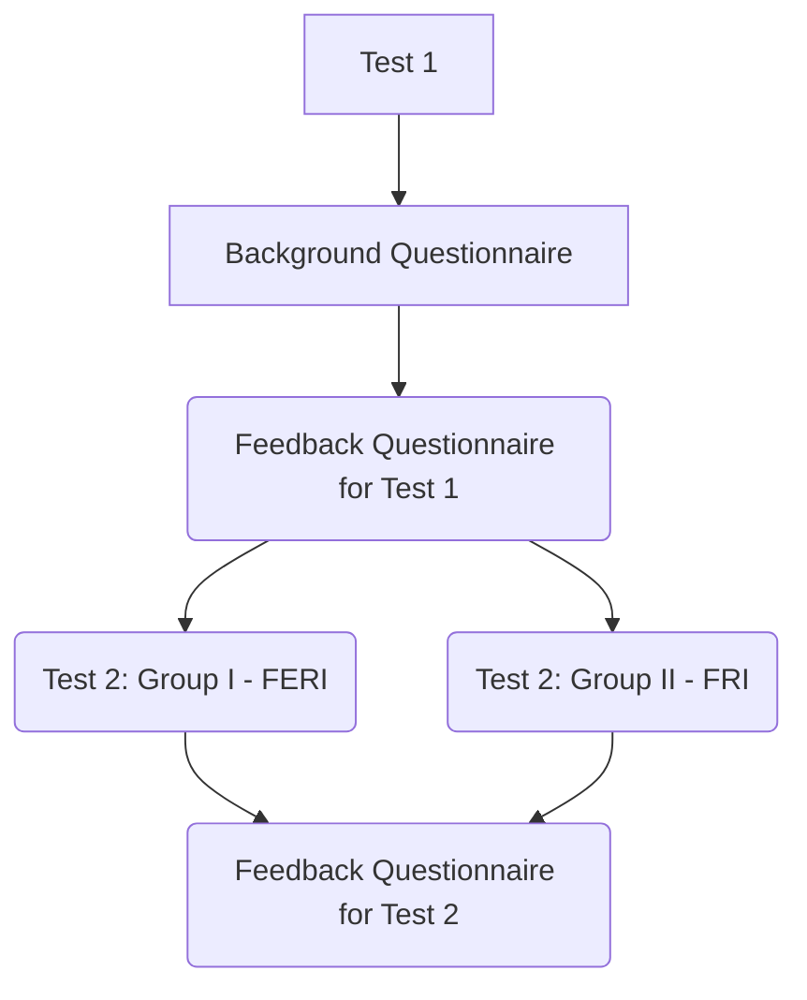

# AG_experiment2023
Supplemental data for the paper **The Impact of Code Bloat on Genetic Program Comprehension:
Replication of a Controlled Experiment on Semantic Inference** by Tomaž Kosar, Željko Kovačević, Marjan Mernik and Boštjan Slivnik.

This paper refers to an earlier experiment described in the paper **On Comprehension of Genetic Programming Solutions: A Controlled Experiment on Semantic Inference** by Boštjan Slivnik, Željko Kovačević, Marjan Mernik and Tomaž Kosar ([Mathematics **2022**, 10, 3386](https://doi.org/10.3390/math10183386)) with the suplemental data available in another [GitHub repository](https://github.com/slivnik/AG_experiement2022) (commit cf47740).

The replicated experiment consisted of

- the [test](https://github.com/slivnik/AG_experiment2023/blob/main/AG%20Comprehension%20Test4.pdf) containing 7 tasks and
- the [background and feedback questionnaires](https://github.com/slivnik/AG_experiment2023/blob/main/AG%20Comprehension%20replication%20background%20%26%20feedback%20questionnaire.pdf).

The results from the replicated study have been compared to the results (on the second test (Group I and Group II) from the original study. Between-subjects design and the relation between studies is depicted in the following table:

The results
- of the [test](https://github.com/slivnik/AG_experiment2023/blob/main/AG_Comprehension_2023_correctness.pdf) are available in [AG_Comprehension_2023_correctness.xlsx](https://github.com/slivnik/AG_experiment2023/blob/main/AG_Comprehension_2023_correctness.xlsx).
- of the [background and feedback questionnaires](https://github.com/slivnik/AG_experiment2023/blob/main/AG_Comprehension_2023_Background_Feedback.pdf) are available in [AG_Comprehension_2023_Background_Feedback.xlsx](https://github.com/slivnik/AG_experiment2023/blob/main/AG_Comprehension_2023_Background_Feedback.xlsx),

xxxxxxxxxxxxxxxxxxxxxxx

The controlled experiment consisted of 
- a [background questionnaire](https://github.com/slivnik/AG_experiement2022/blob/main/AG%20Comprehension%20background%20questionnaire.pdf),
- two tests,
	- [the 1st one](https://github.com/slivnik/AG_experiement2022/blob/main/AG%20Comprehension%20Test1.pdf) given to both groups,
	- the 2nd one in two versions, one [for Group I](https://github.com/slivnik/AG_experiement2022/blob/main/AG%20Comprehension%20Test2%20Group%20I%20(FERI).pdf) and the other [for Group II](https://github.com/slivnik/AG_experiement2022/blob/main/AG%20Comprehension%20Test2%20Group%20II%20(FRI).pdf), and
- two feedback questionnaires,
	- one given [after the 1st test](https://github.com/slivnik/AG_experiement2022/blob/main/AG%20Comprehension%20feedback%20questionnaire%20test1.pdf) and
	- the other given [after the 2nd test](https://github.com/slivnik/AG_experiement2022/blob/main/AG%20Comprehension%20feedback%20questionnaire%20test2.pdf)

as depicted below:

The results
- of the [background questionnaire](https://github.com/slivnik/AG_experiement2022/blob/main/BackgroundFeedback_AG.pdf) are available in `xlsx/BackgroundFeedback_AG.xlsx`,
- of the [tests and feedback questionnaires](https://github.com/slivnik/AG_experiement2022/blob/main/StudyResults_AG.pdf) are available in `xlsx/StudyResults_AG.xlsx`.

